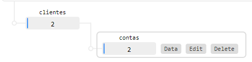
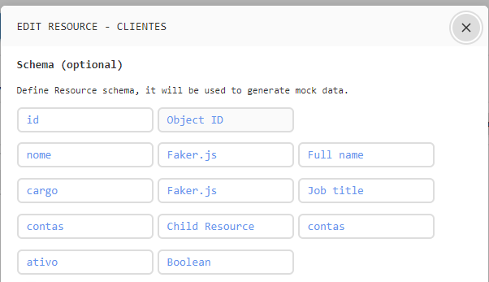
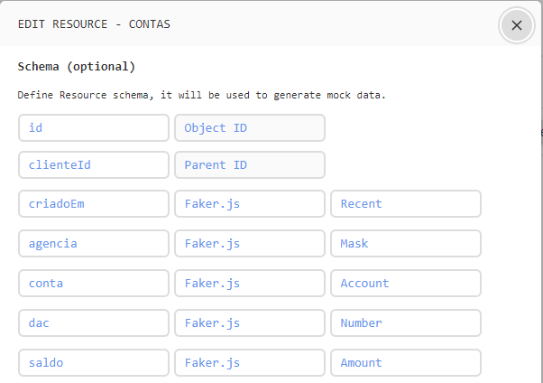

# JAVA PARA NÃO JAVEIROS

### Objetivos

Este projeto tem como objetivo ilustrar um projeto real, focando nos conceitos, fluxo de informação, abordando os principais conceitos. O projeto foi construído ilustrando um recurso de cliente, o qual possui uma lista de contas.

### Escopo

- Mostrar o resultado final, explicando o funcionamento básico.
- Explicar os conceitos principais do projeto
- Adicionar o campo "ativo" ao recurso de cliente
- Implementar o fluxo de deletar um cliente

### Requisitos

- JDK 8+
- Maven
- [Mock API](https://mockapi.io/)

##### Mock API

Será utilizada neste projeto apenas para simular um servico externo. Para executar o projeto com uma conta própria, se cadastre no site, obtenha a URL do seu projeto e então:

1. Procure pela classe **com.everis.helloworld.config.AppConfig**
2. Altere a string **API_URL** na linha 14 com a sua URL obtida

Pronto, é só isso. O seu projeto já irá realizar requisições para a sua conta.

Modelagem dos recursos na plataforma

**Relação entre os recursos**


**Recurso Clientes**


**Recurso Contas**



### Branchs

A branch master contem o projeto final já implementado com todas as features. Já a branch hands-on é a branch utilizada como ponto de partida para o Hands on.

### Como executar o projeto:

1. Clone este repositório
2. Execute:

- Para unix
```sh
  ./mvnw clean install
```

- Para Batch
```sh
  ./mvnw.cmd clean install
```

3) Para iniciar o projeto
```sh   
   ./mvnw spring-boot:run
```

Vá até o navegador e digite [http://localhost:8080](http://localhost:8080) e voce ja verá a aplicação funcionando.

### Nomeclaturas

- **config**: classes de configurações
- **controller**: gerenciam requisições http
- **helper**: recebem os dados vindos das requisições, chamam os servicos responsáveis por processar, recebem o resultado do processamento e então encaminham para os mappers modelarem para o retorno esperado, encaminhando para as controllers
- **service**: classes de servicos onde realizam as chamadas as APIs externas, serializando e desserializando os retornos
- **mappers**: são responsáveis em converter os objetos do domínio da aplicação em objetos de acordo com o contrato das APIs externas. E vice versa tambem.
- **DTOs (Data transfer objects)**: são comumente utilizados para representar os contratos de APIs externas. Servem apenas para trafegar dados
- **ViewModel**: na prática, possuem uma responsabilidade similar aos DTOs (trafegar dados entre as camadas), entretanto, é utilizado dentro do domínio da aplicação. São utilizadas para enviar dados para as JSPs.
- **Utils**: classes utilitárias diversas. Normalmente são compostas de funções utilitárias como formatações de campos, por exemplo.
- **Exception**: classes para representação de exceções

### Fluxo da informação:

1. controller recebe requisição e encaminha pro helper
2. helper encaminha os parametros recebidos do controller (caso existam)
   2.1. Caso existam, o mapper converte os dados em DTOs de acordo com o contrato da API externa e devolve para o helper
3. helper chama o servico associado
4. servico realiza a requisição utilizando os parametros recebidos, recebe o retorno, desserializa e encaminha para o helper
5. helper por sua vez, recebe o retorno em DTO e encaminha para os mappers
6. mappers transformam o retorno em objetos viewModel para retorno dentro do domínio
7. helper retorna os dados processados pelo mapper para o controller
8. o controller responde a requisição passando viewModels em um objeto Model ou ModelAndView (objetos spring), e redirecionando para a JSP correta
